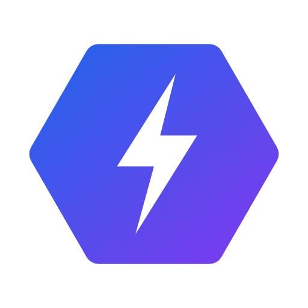
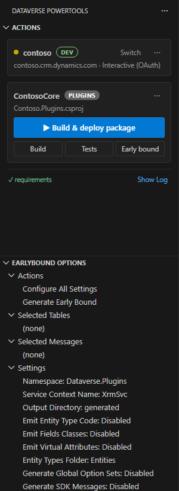
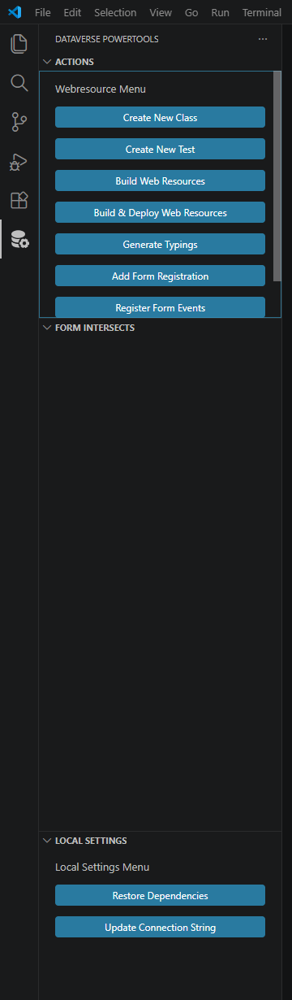
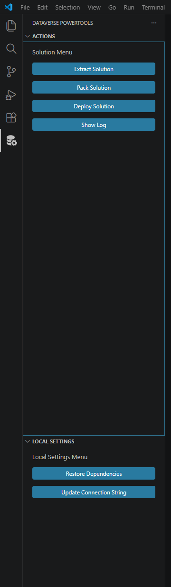
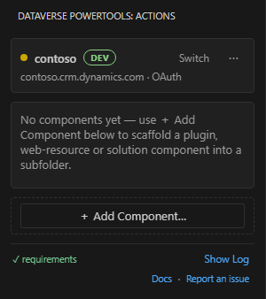
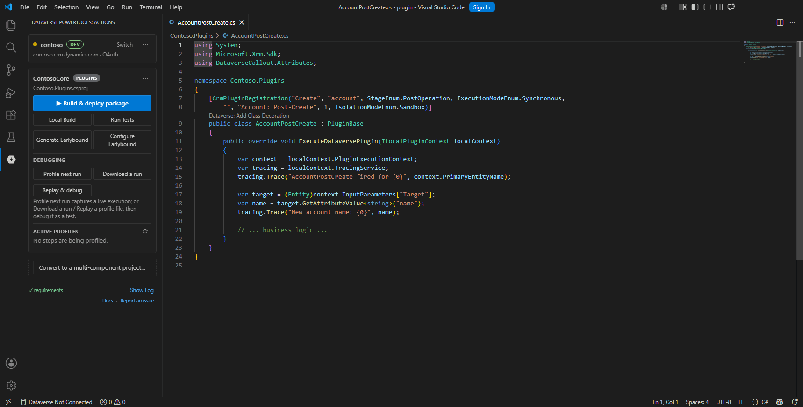

# Dataverse PowerTools

**Build, test, and ship Dataverse & Dynamics 365 — without leaving VS Code.**

Solutions, web resources, and plugins. Scaffold, build, deploy, and unit test from
one activity bar. Cross-platform, powered by the Power Platform CLI and .NET SDK.

[📖 Documentation & walkthroughs →](https://github.com/pete-mc/dataverse-powertools/wiki)

---

## Why Dataverse PowerTools?

- ⚡ **One place for everything** — solutions, TypeScript web resources, C# plugins,
  and Power Pages, all from the Dataverse PowerTools activity bar.
- 🧩 **Scaffolds real projects** — pick a project type and get a working, source-
  controlled project in seconds. **Mix types in one repo**: add plugin, web-resource
  and solution components side by side with *Add Component* — subfolders inherit the
  workspace connection, and every card in the panel targets its own component.
- 🚀 **Build & deploy in a click** — export/pack/import solutions, bundle and deploy
  web resources, build and deploy plugin packages.
- 🧪 **Testing built in** — Jest + xrm-mock for web resources, DataverseUnitTest for
  plugins.
- 🐞 **Real debugging** — hot-reload your local web-resource bundle inside the live
  model-driven app with breakpoints, and **profile a plug-in's next run in one click**
  (Windows, *preview*) then replay it as a unit test you F5-debug in VS Code with the
  exact server-side context.
- 💪 **Strongly typed** — generate `Xrm` typings and early-bound classes from your
  environment.
- 🖥️ **Cross-platform** — Windows, macOS, and Linux, on `pac` and `dotnet`.

## Three project types

| Plugins | Web Resources | Solutions |
| :---: | :---: | :---: |
|  |  |  |
| Create classes & workflows, register steps with CodeLens, generate early-bound types, build with `dotnet`, deploy as a plugin package, read plugin trace logs in-editor, profile a plug-in's next run and replay it as a unit test you F5-debug in VS Code, unit test with DataverseUnitTest. | Write TypeScript, bundle with webpack (or emit one file per web resource), deploy with automatic form-event registration, debug your local bundle live in the real app with hot reload, generate strongly-typed `Xrm` typings, unit test with Jest + xrm-mock. | Export, unpack, pack and import solutions with `pac` — ready for source control and CI/CD. Power Pages sites round-trip with download/upload too. |
| **[Learn more →](https://github.com/pete-mc/dataverse-powertools/wiki/Plugins)** | **[Learn more →](https://github.com/pete-mc/dataverse-powertools/wiki/Webresources)** | **[Learn more →](https://github.com/pete-mc/dataverse-powertools/wiki/Solutions)** |

## Or start empty — mix components in one repo

Initialise an **Empty** project (just a connection) and add plugin, web-resource
and solution components side by side with **＋ Add Component** — each lands in its
own subfolder, inherits the workspace connection, and gets its own card in the panel.
It's the natural layout for a real solution repo: one connection, many components,
all built and deployed from the same place.

 

## Debug plug-ins in VS Code — *preview*

Profile a plug-in's real server-side execution, replay it as a unit test you **F5-debug**
with the exact captured context (no live org), and read plug-in trace logs rendered
right in the editor — all from the plugin card's **Debugging** block.

## Preview features

Some features ship switched off while they finish manual testing. Tick **Preview features**
at the bottom of the Dataverse PowerTools panel (or set `dataverse-powertools.previewFeatures`)
to show them:

- **Azure Functions** — scaffold a Dataverse-aware function, register the webhook and step.
- **Plug-in debugging** — Profile next run, Download a run, Replay & debug, and the per-step
  `Profile` CodeLens.
- **Custom APIs** — define, generate handlers and typed clients, deploy, and invoke.

Everything else is on by default.

## Get started in minutes

1. Install the prerequisites: **.NET SDK**, **Node.js**, and the **Power Platform CLI**.
2. Open a folder and run **Dataverse PowerTools: Initialise Project**.
3. Pick a project type, connect your environment, and start building.

👉 **[Full getting-started guide](https://github.com/pete-mc/dataverse-powertools/wiki/Requirements)**

## Documentation

Detailed walkthroughs for every feature live in the
**[wiki](https://github.com/pete-mc/dataverse-powertools/wiki)**:

- [Getting Started](https://github.com/pete-mc/dataverse-powertools/wiki/Requirements)
- [Solutions](https://github.com/pete-mc/dataverse-powertools/wiki/Solutions)
- [Web Resources](https://github.com/pete-mc/dataverse-powertools/wiki/Webresources)
- [Plugins](https://github.com/pete-mc/dataverse-powertools/wiki/Plugins)

## License & contributing

Free and open source. Issues and contributions are welcome on
[GitHub](https://github.com/pete-mc/dataverse-powertools). See
[CONTRIBUTING.md](CONTRIBUTING.md).
